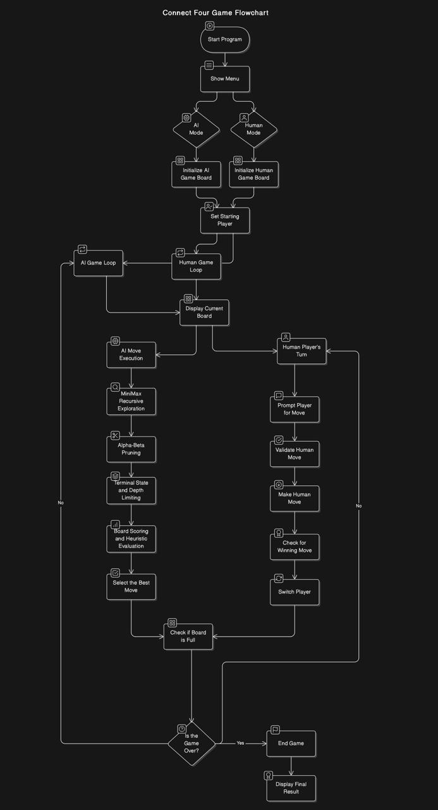

# Connect4 Game

## Instructions to Compile

**Assuming the use of a Linux terminal**

1. **Make sure necessary build tools are downloaded:**
    ```sh
    sudo apt install build-essential
    ```

2. **Install SFML:**
    ```sh
    sudo apt install libsfml-dev -y
    ```

3. **Compile the code:**
    ```sh
    g++ ConnectFourMain.cpp -o connect4 -lsfml-graphics -lsfml-window -lsfml-system
    ```

4. **Run the code:**
    ```sh
    ./connect4
    ```

## Instructions to Play

1. **Select Game Mode:**
    - Click the respective button (Play against Human or AI).

2. **A new window will pop up.**

3. **Gameplay:**
    - Click on a column to drop a chip there.
    - If you're playing against AI, it will automatically make a move.
    - If you're playing against another player, the turn will automatically switch over to them.

4. **Winning the Game:**
    - The first player to have four chips in a row will win.
    - If the board is filled without either player's victory, it will be counted as a draw.


## Flowchart

**Showing the general flow of the code.**